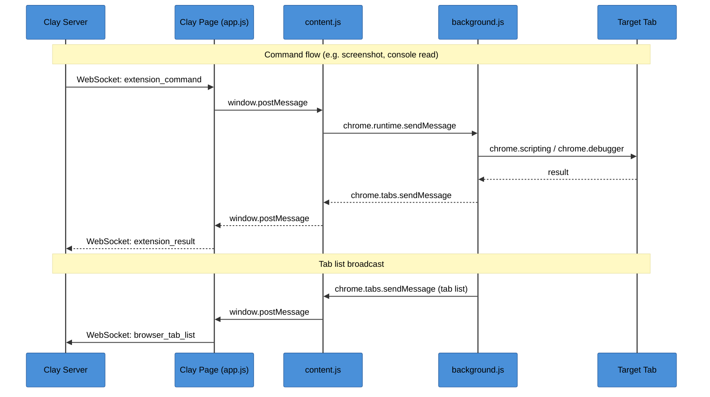

# Clay Chrome Extension

Connect your browser to [Clay](https://github.com/chadbyte/clay). Gives Claude eyes into your browser: open tabs, page content, screenshots, console logs, network requests, and arbitrary JS execution.

Manifest V3. Zero config. Install and it works.

## Install

Clay serves the extension as a downloadable zip. In any Clay project, click the puzzle icon in the top bar to download and install.

Alternatively, load unpacked from this repo for development:

1. `git clone https://github.com/chadbyte/clay-chrome.git`
2. Open `chrome://extensions`
3. Enable "Developer mode"
4. Click "Load unpacked" and select the cloned directory

## How it works

The extension never talks to the Clay server directly. It piggybacks on the Clay web page that is already open in your browser.



## Files

```
clay-chrome/
  manifest.json     Manifest V3 config
  background.js     Service worker: tab tracking, command dispatch
  content.js        Injected into Clay tabs: message bridge
  inject.js         Injected into target tabs: console/network capture
  icons/            Extension icons (16, 48, 128)
```

No popup. No options page. No UI in the extension itself. All UI lives in Clay.

## Commands

All commands are dispatched via `COMMANDS` in background.js. They arrive from the Clay server through the WebSocket/postMessage relay chain.

### Tab management

| Command | Args | Description |
|---------|------|-------------|
| `tab_open` | `url`, `active?` | Open a new tab |
| `tab_close` | `tabId` | Close a tab |
| `tab_activate` | `tabId` | Switch to a tab |
| `tab_navigate` | `tabId`, `url` | Navigate tab to URL |
| `tab_wait_navigation` | `tabId`, `timeout?` | Wait for page load to complete |

### Injection

| Command | Args | Description |
|---------|------|-------------|
| `tab_inject` | `tabId` | Inject `inject.js` into the tab (MAIN world) |

`inject.js` monkey-patches `console.*`, `fetch`, and `XMLHttpRequest` to capture logs and network requests into `window.__clay_console_buffer` and `window.__clay_network_buffer`. It also captures uncaught errors and unhandled promise rejections.

Injection is idempotent (guarded by `window.__clay_injected`). The `injectedTabs` Set tracks which tabs have been injected to avoid redundant calls. Page navigation clears the tracking since the script is lost on reload.

### Page data (no debugger needed)

These use `chrome.scripting.executeScript` in `MAIN` world, so they work even when DevTools is open.

| Command | Args | Returns | Description |
|---------|------|---------|-------------|
| `tab_console` | `tabId` | `{ logs }` | Read `__clay_console_buffer` (JSON string) |
| `tab_network` | `tabId` | `{ network }` | Read `__clay_network_buffer` (JSON string) |
| `tab_dom` | `tabId` | `{ html }` | Full `document.documentElement.outerHTML` |
| `tab_page_text` | `tabId` | `{ text }` | `document.body.innerText` (32KB cap, CSP-safe) |
| `tab_evaluate` | `tabId`, `script` | `{ value }` or `{ error }` | Eval arbitrary JS in page context |

`tab_console` and `tab_network` call `ensureInjected()` first. `tab_page_text` exists as a CSP-safe alternative to `tab_evaluate` for reading page text (avoids `eval()`).

### Debugger commands

These use `chrome.debugger` (CDP protocol 1.3). Only one debugger can attach per tab, so these conflict with DevTools if it is open.

| Command | Args | Returns | Description |
|---------|------|---------|-------------|
| `tab_screenshot` | `tabId`, `selector?` | `{ image }` | Capture viewport or element as base64 PNG |

When `selector` is provided, the element's bounding rect is computed via `Runtime.evaluate` and passed as a `clip` parameter to `Page.captureScreenshot`.

## Integration with Clay

Clay uses this extension for two things:

1. **Context sources**: Users select browser tabs as context sources. Each message automatically includes console logs, network requests, page text, and a screenshot from the selected tabs.
2. **MCP tools**: Clay's Browser MCP server exposes 17 `browser_*` tools to Claude, which call extension commands through an HTTP bridge.

## Permissions

- `tabs` - Read tab URLs and titles
- `activeTab` - Access the active tab
- `debugger` - Chrome DevTools Protocol for screenshots
- `scripting` - Inject scripts into pages
- `host_permissions: <all_urls>` - Required for `chrome.scripting.executeScript` on arbitrary tabs

## Security

- Content script only runs on `*.clay.studio`, `localhost`, and `127.0.0.1`
- Extension only executes commands originating from the authenticated Clay server
- Tab list excludes Clay tabs themselves (prevents recursive debugging)
- `chrome.debugger` shows Chrome's built-in "debugging this tab" banner (cannot be suppressed)
